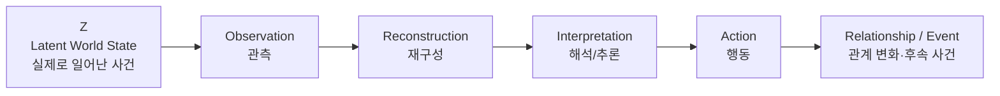
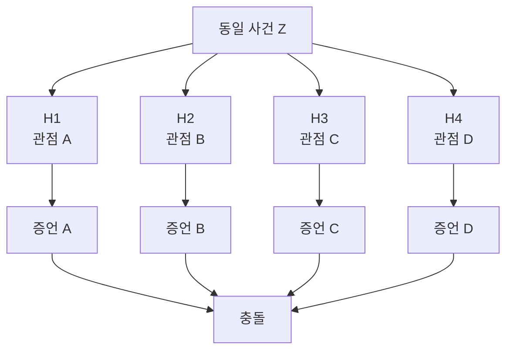
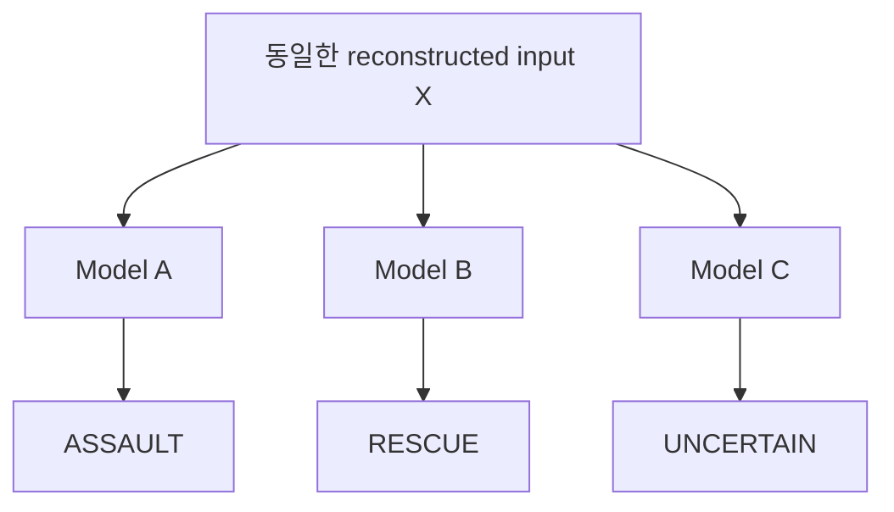

# 인간 시각–AI 시각–Rashomon 극영화 플롯 프레임워크
## Table & Figure 중심 버전

---

# Figure 1. 작품의 최상위 인식 구조



### 핵심

\[
Z
\rightarrow
Observation
\rightarrow
Reconstruction
\rightarrow
Interpretation
\rightarrow
Action
\]

영화는 `Z`를 직접 공개하지 않는다.

---

# Table 1. 각 단계의 기능과 영화적 질문

| 단계 | 인간 | CCTV/데이터 | AI | 영화의 질문 |
|---|---|---|---|---|
| **World State** | 직접 접근 불가 | 직접 접근 불가 | 직접 접근 불가 | 실제로 무슨 일이 있었는가? |
| **Observation** | 시야·주의·가림 | 화각·위치·가림 | 제공된 영상만 입력 | 무엇이 관측되었는가? |
| **Reconstruction** | 기억·사후정보 | clip/window/event 구성 | temporal input 구성 | 무엇을 하나의 사건으로 묶었는가? |
| **Interpretation** | 의도·맥락 판단 | — | feature 기반 prediction | 같은 자료에서 왜 판단이 갈리는가? |
| **Action** | 증언·은폐·추적 | 자료 선택 | 판정 활용 | 그 판단 때문에 무엇을 하는가? |

---

# Figure 2. 핵심 사건의 최소 물리 단위

```text
t-2              t-1               t0               t+1              t+2
│                 │                 │                 │                 │
균형 상실 ─────→ 팔을 뻗음 ─────→ 신체 접촉 ─────→ 몸의 이동 ─────→ 추락
                                      ↑
                               결정적 모호성
```

## 사건의 기본 질문

> 밀었는가?

vs.

> 넘어지는 사람을 붙잡으려 했는가?

---

# Table 2. 사건 내부의 Cue Conflict

| Cue | 관측 가능한 정보 | 가능한 해석 |
|---|---|---|
| **Local contact cue** | 손과 몸의 순간적 접촉 | 밀침/공격 |
| **Global configuration** | 두 사람의 전체 자세 | 구조/방어/접촉 |
| **Temporal trajectory** | 접촉 전후 움직임 | 이미 균형을 잃었음 / 의도적으로 밀었음 |
| **Face / gaze** | 시선·표정 | 공포 / 분노 / 놀람 |
| **Occlusion** | 결정적 부분 결측 | 나머지 정보로 보완 필요 |

### 원칙

\[
Local\ cue
\neq
Global\ cue
\neq
Temporal\ cue
\]

서로 다른 cue가 **서로 다른 답을 지지하도록 사건 자체를 설계한다.**

---

# Figure 3. 인간 4인의 Rashomon 구조



---

# Table 3. 인간 인물 설계 행렬

> 아래는 캐릭터 확정안이 아니라 기능 슬롯이다.

| 인물 | 욕망 | 위치/시점 | 주된 관측정보 | 놓친 정보 | 사후 정보 | 최종 증언 | 증언으로 얻는 것/잃는 것 |
|---|---|---|---|---|---|---|---|
| H1 | TBD | TBD | 얼굴/표정 | 손 접촉 | TBD | TBD | TBD |
| H2 | TBD | TBD | 손/접촉 | 전체 자세 | TBD | TBD | TBD |
| H3 | TBD | TBD | 공간배치 | 접촉 순간 | TBD | TBD | TBD |
| H4 | TBD | TBD | 사건 전후 | 순간 세부 | TBD | TBD | TBD |

## 캐릭터 공식

\[
욕망
\rightarrow
주의
\rightarrow
관측
\rightarrow
기억
\rightarrow
증언
\rightarrow
행동
\]

**feature를 먼저 인물에게 할당하지 않는다.**

인물의 욕망·위치·행동을 정한 뒤 결과적으로 어떤 feature를 보게 되었는지를 결정한다.

---

# Figure 4. 인간 기억 재구성

```text
사건
 │
 ▼
초기 관측
 │
 ▼
초기 기억
 │
 ├──────── 타인의 증언
 ├──────── 유도 질문
 ├──────── 뉴스/소문
 └──────── 자신의 이해관계
 │
 ▼
재구성된 기억
 │
 ▼
증언
```

### 핵심

\[
Observed\ event
\neq
Remembered\ event
\neq
Testimony
\]

---

# Figure 5. 정상적인 다중 CCTV 구조

```text
                         Z
                  실제 동일 사건
                        │
       ┌────────────────┼────────────────┐
       │                │                │
       ▼                ▼                ▼
   CAMERA A         CAMERA B         CAMERA C
    정면              측면              상부
       │                │                │
       ▼                ▼                ▼
 접촉 강조        trajectory 강조      거리/배치 강조
```

## 핵심 원칙

\[
Projection_A(Z)
\neq
Projection_B(Z)
\neq
Projection_C(Z)
\]

그러나

\[
Camera_A,\ Camera_B,\ Camera_C
\]

는 **모두 정상**이다.

---

# Table 4. CCTV 설계 원칙

| 항목 | 채택 | 배제 |
|---|---|---|
| 카메라 위치 차이 | O | |
| 화각 차이 | O | |
| 자연스러운 occlusion | O | |
| 정상적인 시점 차이 | O | |
| 카메라 고장 | | X |
| 터무니없는 저화질 | | X |
| 우연한 파일 손상 | | X |
| 억지 timestamp 오류 | | X |
| 관리자의 황당한 실수 | | X |

### 목표

> “CCTV가 쓰레기였다”

가 아니라

> **“정상적인 관측도 하나의 투영일 뿐이다.”**

---

# Figure 6. Temporal Window에 따른 사건 재구성

## Raw event

```text
균형 상실 → 손을 뻗음 → 접촉 → 몸 이동 → 추락
```

### Window A

```text
[ 손을 뻗음 → 접촉 → 몸 이동 ]
```

**가능한 해석:** 밀침

### Window B

```text
[ 균형 상실 → 손을 뻗음 → 접촉 ]
```

**가능한 해석:** 구조 시도

### Window C

```text
[ 접촉 → 몸 이동 → 추락 ]
```

**가능한 해석:** 공격

---

# Table 5. 사건 자체와 데이터 단위의 구분

| 층 | 대상 | 자연적으로 주어진 것인가? |
|---|---|---:|
| Z | 실제 사건 | O |
| Camera observation | 카메라별 투영 | 장치에 의해 생성 |
| Raw recording | 연속 기록 | 기록 시스템에 의해 생성 |
| Selected clip | 잘라낸 영상 | **선택됨** |
| Event window | 분석시간 범위 | **정의됨** |
| Model input | 전처리된 데이터 | **구성됨** |
| Prediction | AI 판정 | **추론됨** |

### 핵심 관계

\[
Z
\neq
Raw\ Video
\neq
Selected\ Clip
\neq
Event\ Unit
\neq
Model\ Input
\]

---

# Figure 7. Chronos식 역추적이 들어가는 위치

```text
                영화 전체 인식 구조
                       │
                       ▼
Z → Observation → Reconstruction → Interpretation
                    ▲                ▲
                    │                │
              Chronos식 사고        ML
```

## 후반부 수사의 방향

```text
Prediction
    ↑
Model
    ↑
Model Input
    ↑
Temporal Window
    ↑
Camera / Source
```

즉,

\[
Inference
\leftarrow
Input
\leftarrow
Reconstruction
\leftarrow
Time
\leftarrow
Source
\]

Chronos Core는 영화 소재가 아니라 **후반부 증거 역추적 방법론**이다.

---

# Figure 8. AI 모델 다원성 구조



---

# Table 6. AI 모델 기능 슬롯

| 모델 | 전체 검증성능 | 사건 X의 판정 | 상대적으로 민감한 정보 | 검증 방법 |
|---|---:|---|---|---|
| M_A | 유사 | Assault | local/contact | 해당 영역 perturbation |
| M_B | 유사 | Rescue | global/configuration | silhouette/configuration perturbation |
| M_C | 유사 | Uncertain | temporal trajectory | temporal window perturbation |

**주의:** 실제 모델 전체를 이 세 feature로 환원한다는 뜻이 아니다.

영화적으로 관측 가능한 차이를 압축한 것이다.

---

# Figure 9. AI 다원성의 3층 개념

```text
UNDERSPECIFICATION
      │
      │ 같은 개발 기준을 만족하는
      │ 여러 모델이 살아남음
      ▼
M_A   M_B   M_C
      │
      │ 특정 사례에서
      ▼
PREDICTIVE MULTIPLICITY
      │
      │ 왜 이 사례에서 갈렸는가?
      ▼
CUE ANALYSIS / INTERVENTION
```

### 관계

\[
Underspecification
\rightarrow
Predictive\ Multiplicity
\rightarrow
Cue\ Analysis
\]

---

# Table 7. 세 개념의 역할 분리

| 개념 | 질문 | 영화에서의 역할 |
|---|---|---|
| **Underspecification** | 왜 여러 동급 모델이 존재하는가? | 근본 조건 |
| **Predictive multiplicity** | 왜 이 사건에서 예측이 충돌하는가? | 관객이 목격하는 현상 |
| **Cue analysis** | 각 모델이 이 사건에서 무엇에 민감했는가? | 부분적 설명 |

---

# Figure 10. AI Cue Intervention 시퀀스

```text
원본 영상
   │
   ├── 손 영역 제거
   │       └── M_A prediction 급변
   │
   ├── 전체 자세 정보 제거
   │       └── M_B prediction 급변
   │
   └── 직전 temporal frames 제거
           └── M_C prediction 급변
```

### 영화적 결론

> 같은 영상을 입력받았다고 해서  
> 같은 증거에 의존한 것은 아니다.

---

# Figure 11. Saliency/XAI의 위치

```text
Prediction
    │
    ▼
Saliency / Heatmap
    │
    ▼
"AI가 여기를 봤다?"
    │
    ▼
Perturbation Test
    │
    ├── 일치 → 설명에 일부 신뢰
    │
    └── 불일치 → 설명의 한계 노출
```

### 원칙

Saliency map을

> AI의 실제 내적 사고 과정

으로 확정하지 않는다.

---

# Figure 12. 세 번의 Certainty Collapse

```text
┌───────────────────────────────┐
│  COLLAPSE 1                  │
│  HUMAN CERTAINTY             │
│  "누가 거짓말하지?"          │
└─────────────┬─────────────────┘
              ▼
┌───────────────────────────────┐
│  COLLAPSE 2                  │
│  AI CERTAINTY                │
│  "AI라면 답을 주겠지."       │
└─────────────┬─────────────────┘
              ▼
┌───────────────────────────────┐
│  COLLAPSE 3                  │
│  DATA CERTAINTY              │
│  "그래도 영상은 원본이지."   │
└─────────────┬─────────────────┘
              ▼
             BLACK
               Z
```

---

# Table 8. 3막 구조와 Certainty Collapse

| 구간 | 관객의 믿음 | 사건 | 무너지는 확실성 | 새로운 질문 |
|---|---|---|---|---|
| **Act 1** | 누군가는 거짓말한다 | 인간 4인의 충돌 | 인간 증언 | 실제로 무엇을 봤나? |
| **Act 2-A** | 영상이면 해결된다 | CCTV 등장 | 인간 우위/열위 구도 | 영상은 무엇을 보여주나? |
| **Act 2-B** | AI면 하나의 답이 나온다 | AI 모델들 충돌 | AI 확실성 | 왜 같은 입력에서 갈리나? |
| **Act 2-C** | 모델 차이는 설명 가능하다 | cue intervention | 설명의 완전성 | 어디까지 설명 가능한가? |
| **Act 3** | 그래도 사건 영상 자체는 주어졌다 | window/reconstruction 발견 | 데이터 확실성 | 누가 사건의 경계를 정했나? |
| **Ending** | 원본까지 가면 진실을 찾을 수 있다 | Z 비공개 | 최종 접근 가능성 | 사건 자체와 재현은 같은가? |

---

# Figure 13. 관객 질문의 변화

```text
누가 거짓말하는가?
        │
        ▼
누가 무엇을 보았는가?
        │
        ▼
같은 영상을 왜 다르게 판단하는가?
        │
        ▼
각 판단은 무엇에 의존했는가?
        │
        ▼
그 영상은 어디서부터 어디까지가 '사건'인가?
        │
        ▼
우리는 사건 자체에 도달한 적이 있는가?
```

---

# Table 9. BLACK / Z 사용규칙

| 항목 | 의미 |
|---|---|
| BLACK = 맹인의 시야 | X |
| BLACK = 아무것도 없음 | X |
| BLACK = 진실은 존재하지 않음 | X |
| BLACK = 플라톤 이데아 | X |
| BLACK = 관객에게 직접 제공되지 않는 사건 상태 Z | O |
| BLACK = certainty collapse 사이의 반복 모티프 | O |

---

# Figure 14. 극영화 엔진

```text
                 인식론 / 과학
                      │
                      ▼
                    정보
                      │
                      ▼
욕망 ─────→ 행동 ─────→ 관계 변화 ─────→ 사건
 ▲                                      │
 └──────────────────────────────────────┘
```

과학적 feature나 개념은 그 자체로 장면이 될 수 없다.

반드시:

\[
욕망
\rightarrow
행동
\rightarrow
관계
\rightarrow
사건
\]

으로 변환해야 한다.

---

# Table 10. 장면 감사표(Scene Audit)

| 질문 | YES 조건 |
|---|---|
| 누가 무엇을 원하는가? | 욕망 명확 |
| 실제로 무엇을 하는가? | 행동 존재 |
| 누구와 충돌하는가? | 관계 변화 |
| 어떤 정보가 새로 생기는가? | 정보 증가/변형 |
| 이후 장면의 의미를 바꾸는가? | 상호작용 존재 |
| 삭제하면 이후 플롯이 달라지는가? | 반드시 YES |
| 단순 과학 설명 장면인가? | 반드시 NO |

---

# Table 11. 금지사항

| 금지 | 이유 |
|---|---|
| 인간=주관 / AI=객관 | 작품 구조 붕괴 |
| 인간=shape / AI=texture | 본질주의 |
| AI를 제5의 인간 증인처럼 의인화 | Rashomon 구조 과밀 |
| CCTV 고장으로 해결 | 핍진성 저하 |
| timestamp 실수로 최종 반전 | "관리 개판" 문제로 축소 |
| saliency=AI가 본 곳 | XAI 과장 |
| CNN layer=시각피질 1:1 | 신경과학 과장 |
| Z를 마지막에 객관적 영상으로 공개 | 작품의 인식구조 붕괴 |
| 등장인물이 ML 논문을 설명 | 극영화 → 강의영상 |
| feature 하나=인물 하나 | 캐릭터 체크리스트화 |

---

# Table 12. 아직 비어 있는 핵심 변수

| 변수 | 현재 상태 | 결정 기준 |
|---|---|---|
| 핵심 사건 | 미정 | 2~3초 안에 cue conflict 가능 |
| 장소 | 미정 | 다중 CCTV가 자연스러움 |
| 피해 결과 | 미정 | 인물 욕망을 충분히 발생시킴 |
| 주인공 | 미정 | 세 certainty collapse를 추적할 이유 |
| 인간 4인 관계 | 미정 | 동일 사건에 서로 다른 stake 보유 |
| AI 도입 주체 | 미정 | AI를 사용할 현실적 이유 |
| 사건 window 설정자 | 미정 | Act 3 갈등과 연결 |
| Z의 실제 내용 | 작가만 알고 있을 수도 있음 | 관객에게는 직접 공개하지 않음 |

---

# Figure 15. 전체 플롯 프레임워크 한 장 요약

```text
                              Z
                       LATENT WORLD STATE
                              │
               ┌──────────────┴───────────────┐
               │                              │
               ▼                              ▼
          HUMAN OBSERVERS                  CAMERAS
          H1 H2 H3 H4                    C1 C2 C3
               │                              │
               ▼                              ▼
      서로 다른 관측·기억             서로 다른 정상 투영
               │                              │
               └──────────────┬───────────────┘
                              ▼
                     EVENT RECONSTRUCTION
                   "어디까지가 사건인가?"
                              │
                              ▼
                         MODEL INPUT
                              │
                  ┌───────────┼───────────┐
                  ▼           ▼           ▼
                 M_A         M_B         M_C
                  │           │           │
               Assault     Rescue     Uncertain
                  └───────────┼───────────┘
                              ▼
                      CUE INTERVENTION
                  local / global / temporal
                              │
                              ▼
                   PARTIAL EXPLANATION
                              │
                              ▼
                 INPUT / EVENT UNIT 추적
                              │
                              ▼
                         certainty ↓
                              │
                              ▼
                           BLACK
                              │
                              ▼
                              Z
                     직접 공개되지 않음
```

---

# Table 13. 최종 플롯 핵심 요약

| 층 | 다원성 발생원 | 핵심 질문 |
|---|---|---|
| **Human** | 관점·주의·기억·욕망 | 왜 서로 다르게 기억하는가? |
| **Camera** | 정상적인 spatial projection 차이 | 무엇이 실제로 기록되었는가? |
| **Reconstruction** | event boundary / temporal window | 무엇을 하나의 사건으로 정의했는가? |
| **AI** | predictive multiplicity / cue reliance | 왜 동급 모델이 갈리는가? |
| **XAI** | 설명 자체의 불완전성 | 왜 그렇다고 말할 수 있는가? |
| **Z** | 직접 접근 불가능 | 사건 자체에 얼마나 가까이 갈 수 있는가? |

---

# 한 문장 구조

> 네 사람의 상충하는 증언을 해결하기 위해 정상적인 여러 CCTV 영상과 AI 분석이 동원되지만, 비슷한 성능의 AI들마저 서로 다른 결론을 내리고, 그 차이를 추적하는 과정에서 결국 문제는 누가 사건을 잘못 보았느냐가 아니라 여러 관측에서 어디까지를 하나의 '사건'으로 구성했느냐에 있음을 발견하게 된다.
